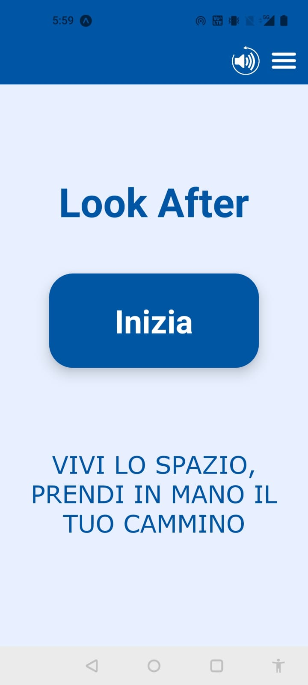
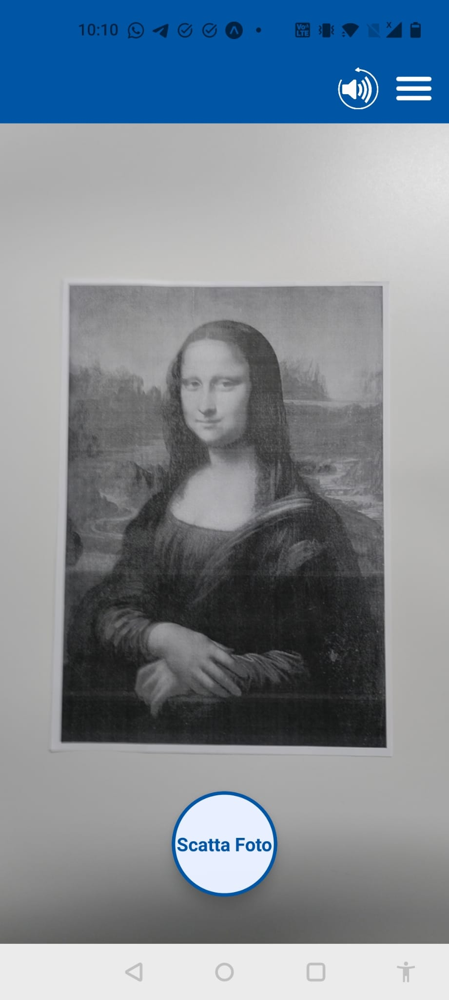
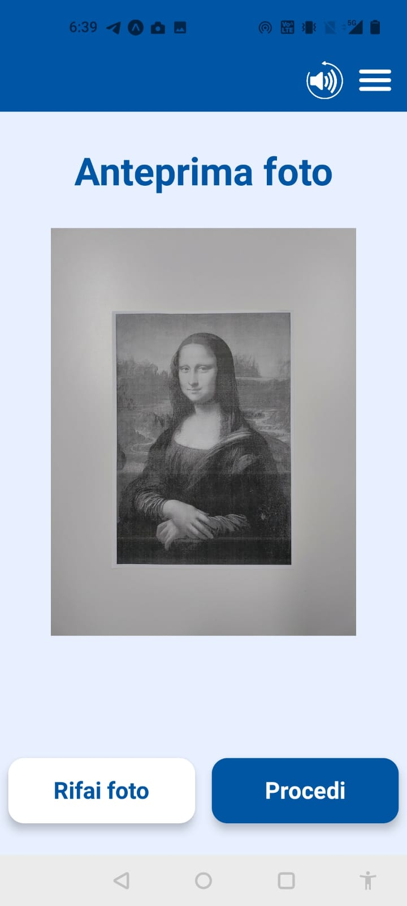
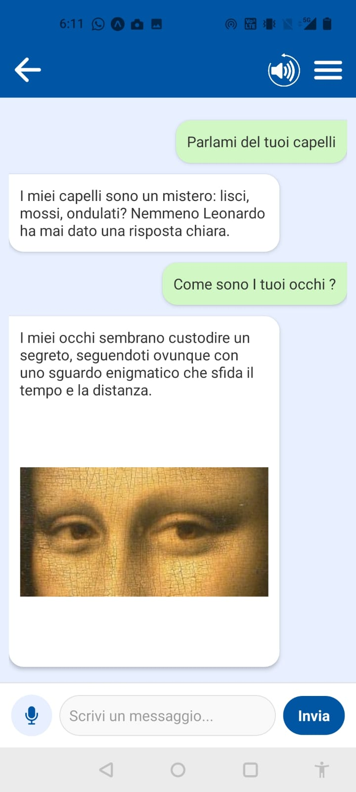
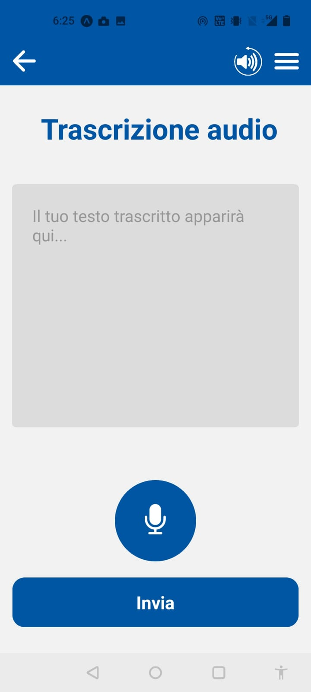
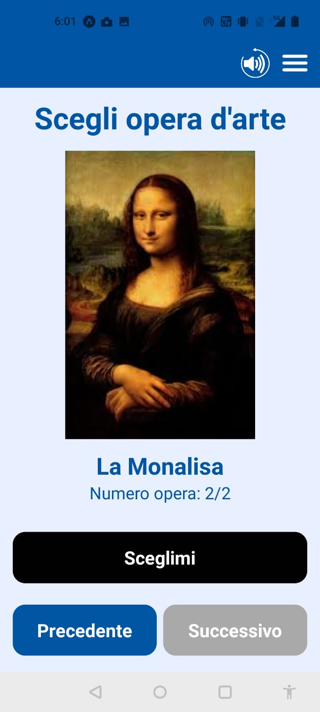

# Setup

### 1. Configure the Client  
Before running the client, verify your IP address and update **line 114** in `functions.js`, located in:  
📂 `client/components/functions.js`  

### 2. Install and Run the Client  

```sh
cd client
npm install  # Install dependencies
npx expo start  # Start the client
```

### 3. Install and Run the Server  

```sh
cd server
npm install  # Install dependencies
node server.js  # Start the server
```

### 4. Ensure Network Connectivity  
Make sure that the Android smartphone running the **Expo Go** app is connected to the same network as the server.<br>

### 5. Insert the Google API Key  
Insert your Google API key in the first line of `.env` in the server to let the speech recognition work.

Then scan the QR code and enjoy.


# Example images

<p><strong>Figure: Various UI changes made in the LookAfter application</strong></p>

<div style="display: flex; gap: 10px;">
  <div style="flex: 1; text-align: center;">
    
    <p>Main Page</p>
  </div>
  <div style="flex: 1; text-align: center;">
    
    <p>Camera Page</p>
  </div>
  <div style="flex: 1; text-align: center;">
    
    <p>Preview Page</p>
  </div>
</div>

<br/>

<div style="display: flex; gap: 10px;">
  <div style="flex: 1; text-align: center;">
    
    <p>Chat Page</p>
  </div>
  <div style="flex: 1; text-align: center;">
    
    <p>Microphone Page</p>
  </div>
  <div style="flex: 1; text-align: center;">
    
    <p>List of Artworks</p>
  </div>
</div>
